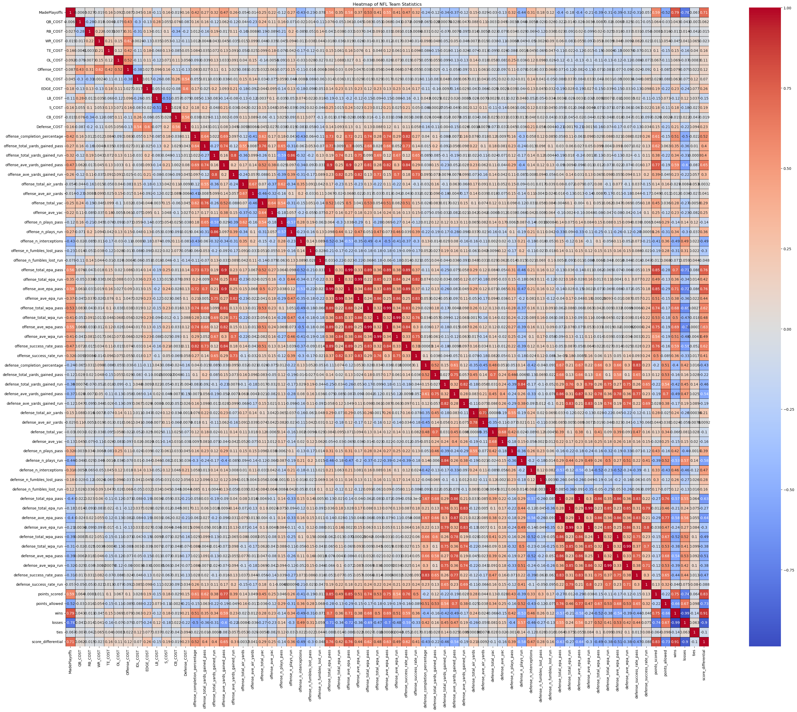
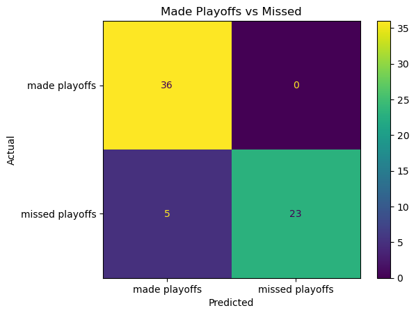
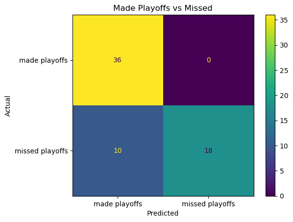

# ucb-mlai-capstone
UC Berkeley ML-AI Capstone project

## Problem Statement:
This application looking to answer the question of "what is the best approach to be able to predict when an NFL football team is going to make the playoffs".  The type of data that is available statistically defines the abilities of the players on a teams, the team as a whole and the cost maintaining such a team with regards to player salaries.

[OPTIONAL]: Once answered this would encourage the question of what is the least amount of money an NFL football team needs to spend to make it to the playoffs.

## Model Outcomes or Predictions:
The problem is one of classification where the application is trying to determine from a supervised learning perspective whether a team shall or shall not make the playoffs based the the abilities of the individual players and the team as a whole.  The basis of the problem is a statistical analysis that measures the ability of each player position on a team as well as the abilities of each teams performance.  This in turn determines whether a team can produce enough wins during a single season to be able to gain entry into the post season (playoffs).

## Data Aquisition:
The data being used comes from three sources listed below.

- NFL team statistics from https://data.scorenetwork.org/football/nfl-team-statistics.html : nfl-team-statistics.csv (circa. 1999 thru 2022).  This data defines game related statistics per year and team such as points scored, points allowed, total rushing yards, etc.
- Scraped data from the website: https://overthecap.com/positional-spending#y2013 thru https://overthecap.com/positional-spending#y2022.  This data shows how much money each team spent per team, player position and year.
- Kaggle data set containing list of NFL teams that made it to the playoffs between 2013 and 2022
  - Data from 2013 thru 2021: NFL_team_playoff_perc_win_data.csv (https://www.kaggle.com/datasets/shanyachaubey/nfl20102021offdefplayoffteamstats?resource=download).
  - Teams that made the playoffs in 2022:
    - Philadelphia Eagles
    - San Francisco 49ers
    - Minnesota Vikings
    - Tampa Bay Buccaneers
    - Dallas Cowboys
    - New York Giants
    - Seattle Seahawks
    - Cincinnati Bengals
    - Jacksonville Jaguars
    - Los Angeles Chargers
    - Baltimore Ravens
    - Buffalo Bills
    - Miami Dolphins
    - Kansas City Chiefs. 

The following correlation matrix was used to identify what correlations exists between the three data sets in an effort to get a feasible understanding if and how the data would best be used to solve this problem.

Note: this correlation matrix was generated using ('pearson') standard correlation coefficients for measuring linear relationships

### Target classes (categorical)
- MadePlayoffs - target classifier that defines whether a team made it to the playoffs in the season for that 'Year' (derived from NFL_team_playoff_perc_win_data.csv)

Note: the class/target feature is imbalanced with regards to fewer teams making it to the playoffs vs teams that did not.

### Input Features 
This is comprised of the data that will eventually be used to either generate the final data sets and/or train the models being evaluated.

#### Index use only
This was used intially as an index for filtering the dataset into training and test data
- Year - (numberic) the year the season was played.
- Team - (String) name and city of NFL football team

#### Cost per team, per year and per position in dollars ($)
- QB_COST - amount of money salaried for quarterbacks
- RB_COST - amount of money salaried for runningbacks
- WR_COST - amount of money salaried for wide receivers
- TE_COST - amount of money salaried for tightends
- OL_COST - amount of money salaried for offensive Lineman
- Offense_COST - amount of money salaried for all players on offense including special teams
- IDL_COST - amount of money salaried for inside defensive lineman
- EDGE_COST - amount of money salaried for edge rushers
- LB_COST - amount of money salaried for linebackers
- S_COST - amount of money salaried for safeties (free and strong)
- CB_COST - amount of money salaried for cornerbacks
- Defense_COST - amount of money salaried for all players on defense including special teams

#### Basic statistics
- wins - number of wins during a regular season per team.
- losses - number losses during a regular season per team.
- ties - number of ties during a regular season per team
- points_scored - Total number of points scored by the team
- points_allowed - Total number of points allowed by the team
- score_differential - (points scored - points allowed)

#### Offensive Statistics per team and year
- offense_completion_percentage - Passing completion percentage for offense
- offense_total_yards_gained_pass - Total number of yards gained on offense per play by play type pass
- offense_total_yards_gained_run - Total number of yards gained on offense per play by play type run
- offense_ave_yards_gained_pass - Average number of yards gained on offense per play by play type pass
- offense_ave_yards_gained_run - Average number of yards gained on offense per play by play type run
- offense_total_air_yards - Total number of air yards gained on offense where air yards correspond to perpendicular yards traveled from the line of scrimmage to location of catch for passing plays
- offense_ave_air_yards - Average number of air yards gained on offense per passing play
- offense_total_yac - Total number of yards after catch gained on offense
- offense_ave_yac - Average number of yards after catch gained on offense per passing play
- offense_n_plays_pass - Total number of plays by the team on offense by play type pass
- offense_n_plays_run - Total number of plays by the team on offense by play type run
- offense_n_interceptions - Total number of interceptions thrown by offense
- offense_n_fumbles_lost_pass - Total number of fumbles lost by offense by play type pass
- offense_n_fumbles_lost_run - Total number of fumbles lost by offense by play type run
- offense_total_epa_pass - Total expected points added by offense by play type pass
- offense_total_epa_run - Total expected points added by offense by play type run
- offense_ave_epa_pass - Average expected points added by offense per play by play type pass
- offense_ave_epa_run - Average expected points added by offense per play by play type run
- offense_total_wpa_pass - Total win probability added by offense by play type pass
- offense_total_wpa_run - Total win probability added by offense by play type run
- offense_ave_wpa_pass - Average win probability added by offense per play by play type pass
- offense_ave_wpa_run - Average win probability added by offense per play by play type run
- offense_success_rate_pass - Proportion of plays with positive expected points added on offense by play type pass
- offense_success_rate_run - Proportion of plays with positive expected points added on offense by play type run

#### Defensive Statistics per team and year
- defense_completion_percentage - Passing completion percentage against by defense
- defense_total_yards_gained_pass - Total number of yards allowed by defense per play by play type pass
- defense_total_yards_gained_run - Total number of yards allowed by defense per play by play type run
- defense_ave_yards_gained_pass - Average number of yards allowed by defense per play by play type pass
- defense_ave_yards_gained_run - Average number of yards allowed by defense per play by play type run
- defense_total_air_yards - Total number of air yards allowed by defense, where air yards correspond to perpendicular yards traveled from the line of scrimmage to location of catch for passing plays
- defense_ave_air_yards - Average number of air yards allowed by defense per passing play
- defense_total_yac - Total number of yards after catch allowed by defense
- defense_ave_yac - Average number of yards after catch by defense per passing play
- defense_n_plays_pass - Total number of plays by the team against by defense by play type pass
- defense_n_plays_run - Total number of plays by the team against by defense by play type run
- defense_n_interceptions - Total number of interceptions caught by defense
- defense_n_fumbles_lost_pass - Total number of fumbles forced by defense by play type pass
- defense_n_fumbles_lost_run - Total number of fumbles forced by defense by play type run
- defense_total_epa_pass - Total expected points allowed by defense by play type pass
- defense_total_epa_run - Total expected points allowed by defense by play type run
- defense_ave_epa_pass - Average expected points allowed by defense per play by play type pass
- defense_ave_epa_run - Average expected points allowed by defense per play by play type run
- defense_total_wpa_pass - Total win probability allowed by defense by play type pass
- defense_total_wpa_run - Total win probability allowed by defense by play type run
- defense_ave_wpa_pass - Average win probability allowed by defense per play by play type pass
- defense_ave_wpa_run - Average win probability allowed by defense per play by play type run
- defense_success_rate_pass - Proportion of plays with positive expected points allowed by defense by play type pass
- defense_success_rate_run - Proportion of plays with positive expected points allowed by defense by play type run

- NOTE:  The EPA variables are advanced NFL statistics, conveying how much value a team is adding over the average team in a given situation. It’s on a points scale instead of the typically used yards scale, because not all yards are created equal in American football (10 yard gain on 3rd and 15 is much less valuable than a 2 yard gain on 4th and 1). For offensive stats the higher the EPA the better, but for defensive stats the lower (more negative) the EPA the better. The WPA variables are similar except they are measuring play value in terms of win probability.

## Data Preprocessing/Preparation:
The approach used to clean and organize the data can be found in the following files:
- scraping of data from target web site: [scrape_nfl_team_costs.ipynb](/scrape_nfl_team_costs.ipynb).  From here the raw data was placed in the folder labeled "/raw-data".
- creation of data frames and normalizing of data: [build_target_dataset.ipynb](/build_target_dataset.ipynb).
Both of these efforts lead to the data being saved to the following CSV file: [nfl_team_all_stats_2013_2022.csv](/intermediate-data/nfl_team_all_stats_2013_2022.csv)

Once this was completed the final step for preparing the data was done in the python notebook file: [feature_and_model_evaluation.ipynb](/feature_and_model_evaluation.ipynb).  From here the final dataset was created and split manually by year into the training and test dataset using the following variables.
- X_lte_2020 : training data containing all of the available features other then features related to COST.
- X_gt_2020 : test data containing all of the available features other then features related to COST.
- y_lte_2020_encoded : training data containing the target feature/class that was encoded using the scikit.learn StandardScaler
- y_gt_2020_encoded : test data containing the target feature/class that was encoded using the scikit.learn StandardScaler

Note: All data was encoded using the scikit.learn StandardScaler API.

## Modeling:
The models that were evaluated are as follows:
  - K-Nearest Neighbor Classifier (KNN-C)
  - Decision-Tree Classifier (DT-C)
  - Support Vector Machines (SVC)
  - Random-Forest Classifier (RF-C).  

Note: Due to the nature of the data and the number of features the previously mentioned classifiers were chosen for evaluation.

## Model Evaluation:
### Approach
#### Created baseline for the 4 classifier model types: 
  - K-Nearest Neighbor Classifier (KNN-C)
  - Decision-Tree Classifier (DT-C)
  - Support Vector Machines (SVC)
  - Random-Forest Classifier (RF-C).
It should be noted that only the default paramters were used when generating the baseline values for these models.  The results for this can be found in the JSON file: [allstats_makeplayoffs_baseline_model_results_df.json](/results/allstats_makeplayoffs_baseline_model_results_df.json)

#### Indentify best feature Set:
This was done using the following techniques:
  - scikit.learn permutation importance:  This was needed specifically for the KNN and SVC classifiers.  However, this was also used during the evaluation for all classifiers for completeness.
  - the CCP-Alpha coefficients:  This was generated and used by the DecisionTreeClassifier and RandomForestClassifier models using the DecisionTreeClassifier model's "cost_complexity_pruning_path(..)" method.
It should be noted that feature selection using permutation importance was done using both the Random-Foreset and Decision-Tree classifiers where the later had a slightly lower error when scored.  However, both results were made part of the evaluation for all models that were tested.

#### Train the models using the specified training data:
All models were trained to predict when the MadePlayoffs feature was set to either 1 (= True) or 0 (= False).  The training data used all available features accept for features associated with COST.

#### Evaluate each model's results:
The metrics used to evaluate the performance of the models was root mean squared error (RMSE) and the accuracy of the prediction being made.  The tie breaker for the best models where based on their predictions.  This can be seen using the generated confusion matrices.

The evaluated configuration options for each of the models is listed below:
- DecisionTreeClassifier(random_state=42), hyper-parameters {ccp_alpha}
- RandomForestClassifier(random_state=42), hyper-parameters: {'n_estimators': [100, 1000], ccp_alpha}
- KNeighborsClassifier(), hyper-parameters: {
                                    'n_neighbors': list(range(1, 22, 2)),
                                    'weights': ['uniform', 'distance'],
                                    'p': [1, 2],
                                }
- SVC(random_state=42), hyper-parameters: {
                                    'C': [0.1, 1, 10],
                                    'kernel': ['linear', 'rbf', 'poly', 'linear', 'sigmoid'],
                                    'gamma': [0.1, 1.0, 10],
                                }

##### Results:
When comparing the following models the best model used the DecisionTreeClassifier where the accuracy produced was 92%.  The configuration of the model and the results with regards to score and error are as follows:
Attribute|metric
---|---|
model|decision tree classifier
ccp-alpha|0.011719
impurities|0.070343
nodes|9
depth|4
training score|0.960938
test score|0.921875
error (rmse)|0.241812
test confusion matrix|[[36, 0], [5, 23]]
perm-imp model|decision tree classifier
feature count|54
fit time (seconds)|2.225046

It should be noted that no suggested feature selection from the permutation importance results was implemented in this model which is why the feature count was so high (all features were used).

With that said, a close runner up also used the DecisionTreeClassifier model type.  The differentiator was the error which was slighlty higher.  It would be interesting to see if the difference in the number of features was the result of this occurance.  In this model, the suggested feature sets from permutation importance was implemented where, the model type used to implement feature selection was also a DecisionTreeClassifier.

Attribute|metric
---|---|
model|decision tree classifier
ccp-alpha|0.007283958773784356
impurities|0.051089
nodes|13
depth|4
train score|0.964844
test score|0.921875
error (rmse)|0.261196
test confusion matrix|[[36, 0], [5, 23]]
perm-imp model|decision tree classifier
feature count|5
fit time (seconds)|0.016818

###### Notes On Other Models:
The Random-Forest classifier's performance was comperable to DescisionTree with an accuracy around 87% - 89% and an error equivalent to what was produced by its counter part.
Furthermore, the KNN and SVC classifiers did not perform nearly as well.  The only attempt that was worth mentioning was using SVC which achieved an accuracy of approximately 88% and a very low error.  However, the predictions shown in the confusion matrix are not as compelling.  Maybe if some more data could be aquired the results would get better.  Also, when the features were increased the accuracy decreased and the error (RMSE) increased.

Attribute|metric
---|---|
model|svc
best params|{'C': 0.1, 'gamma': 0.1, 'kernel': 'linear'}
perm-imp model|decision Tree Classifier
feature count|5
train score|0.933594
test score|0.875
error (rmse)|0.22771
test confusion matrix|[[36, 0], [8, 20]]
fit time (seconds)|2.073034

